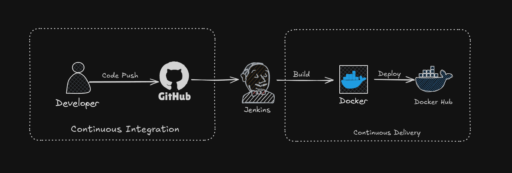

# 📝 TODO List – DevOps Project (Django + Docker + CI/CD + AWS)

This is a beginner-friendly **DevOps project** that showcases a full DevOps pipeline using a **Django TODO List application**. It covers the entire software lifecycle — from development to deployment — using **Docker**, **CI/CD automation**, and **AWS EC2** for hosting.

> 💡 The project is designed to help beginners understand real-world DevOps concepts with practical implementation.

---

## 🚀 Tech Stack & Tools

- **Django** – Backend web framework for Python
- **Docker** – Containerization
- **Git** – Source control
- **GitHub** – Code repository and webhook integration
- **Docker Hub** – Hosting Docker images
- **CI/CD Tool** – (e.g., GitHub Actions / Jenkins)
- **Webhooks** – To auto-trigger the pipeline
- **AWS EC2** – Hosting the live containerized application

---

## ✅ Key Features

- 📝 TODO List app with full **CRUD functionality**
- 🐳 **Dockerized** using a custom `Dockerfile`
- 🔁 **CI/CD pipeline** auto-triggers on code push
- 🧠 **Webhooks** enable real-time automation
- 🌍 **Deployed on AWS EC2** instance
- 🔒 Secure and reproducible environment

---

🔁 CI/CD Pipeline
The CI/CD pipeline automates:

Code checkout from GitHub

Docker image build

Docker image push to Docker Hub

(Optional) SSH into AWS EC2 and redeploy app

Trigger: GitHub Webhook (automatically runs on push)

📸 Screenshots 

The diagram below illustrates the flow of **Continuous Integration** and **Continuous Delivery** using **GitHub**, **Jenkins**, **Docker**, and **Docker Hub**:

👨‍💻 Author
Salil Gupta – DevOps Enthusiast

🔗 GitHub:https://github.com/salilgupta332/

📄 License
This project is licensed under the MIT License
